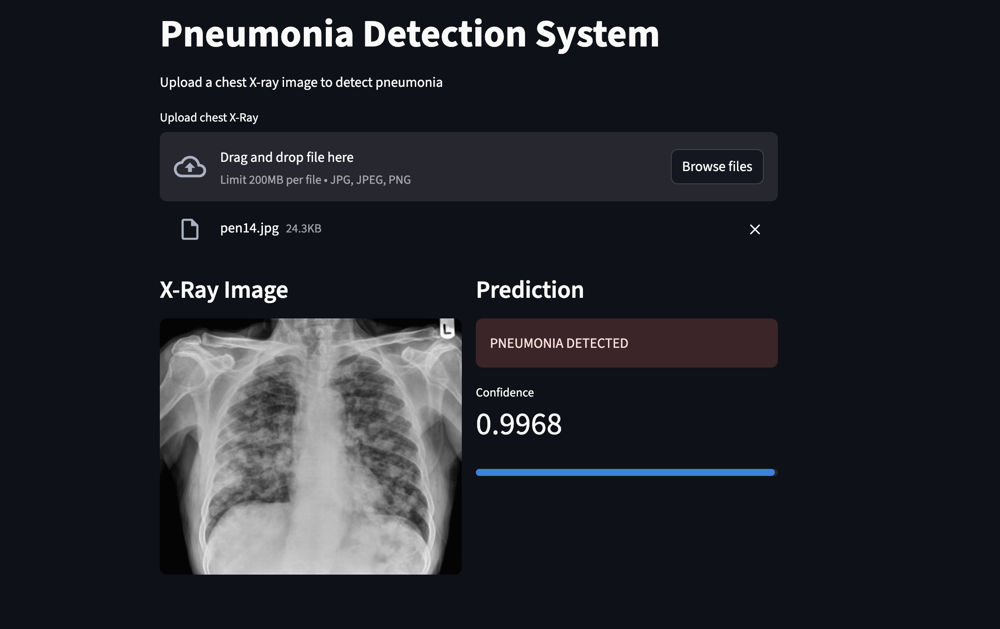

#  Pneumonia Detection System

A deep learning web application that detects pneumonia from chest X-ray images using EfficientNet-B3, achieving **94% test accuracy** with **97% pneumonia recall**.

---

##  Results

| Metric | Value |
|--------|-------|
| Test Accuracy | **94%** |
| PNEUMONIA Recall | **97%** |
| NORMAL Recall | **91%** |
| PNEUMONIA Precision | **94%** |
| NORMAL Precision | **94%** |
| Optimal Threshold | **0.98** |

---

##  Demo



Upload a chest X-ray image and the model predicts whether it shows signs of pneumonia with a confidence score.

---

## Live Demo: ["Click Here"](https://pneumonia-detection-irvttmdt8keypeamjbmznh.streamlit.app/)

##  Model Architecture

| Component | Detail |
|-----------|--------|
| Base Model | EfficientNet-B3 (pretrained on ImageNet) |
| Input Size | 300 × 300 |
| Classifier | Dropout(0.4) → Linear(1536, 1) |
| Loss Function | BCEWithLogitsLoss |
| Optimizer | Adam (lr=1e-5, weight_decay=1e-4) |
| Threshold | 0.98 |

### Training Strategy
- **Phase**: Full fine-tuning — entire backbone unfrozen
- **Scheduler**: ReduceLROnPlateau (patience=3, factor=0.5)
- **Early Stopping**: patience=5, monitors val_loss
- **Class Imbalance**: WeightedRandomSampler (3:1 PNEUMONIA:NORMAL ratio)
- **Best model**: saved automatically when val_loss improves

---

##  Dataset

[Chest X-Ray Images (Pneumonia)](https://www.kaggle.com/datasets/paultimothymooney/chest-xray-pneumonia) from Kaggle

| Split | PNEUMONIA | NORMAL | Total |
|-------|-----------|--------|-------|
| Train | 3418 | 1189 | 4607 |
| Val | 467 | 162 | 629 |
| Test | 390 | 234 | 624 |


---

##  Tech Stack

- **PyTorch** — model training
- **TorchVision** — EfficientNet-B3, transforms
- **Streamlit** — web application
- **scikit-learn** — metrics, stratified split, WeightedRandomSampler
- **Pillow** — image processing
- **Matplotlib / Seaborn** — training visualisation

---

##  How to Run Locally

**1. Clone the repo**
```bash
git clone https://github.com/LimbuSunil2058/pneumonia-detection.git
cd pneumonia-detection
```

**2. Install dependencies**
```bash
pip install -r requirements.txt
```

**3. Run the app**
```bash
streamlit run app.py
```

**4. Open browser**
```
http://localhost:8501
```

---

##  Project Structure

```
pneumonia-detection/
│
├── app.py                  # Streamlit web app
├── best_model.pth          # trained EfficientNet-B3 weights
├── requirements.txt        # dependencies
├── README.md               # project documentation
├── .gitignore              # git ignore rules
│
├── notebook/
│   └── Xray.ipynb          # full training notebook
│
└── assets/
    └── demo.png            # app screenshot
```

---

##  Training Details

### Why EfficientNet-B3?
EfficientNet-B3 was chosen as the sweet spot for this dataset size (~5k images):
- B3 (12M params) fits well with 5k images 
- B4 (19M params) was tested but underperformed — too many parameters for dataset size
- Larger models like ResNet-50 and ViT were ruled out for same reason

### Why Threshold 0.98?
The default 0.5 threshold gave only 80% test accuracy due to class distribution mismatch between train and test sets. Threshold was systematically tuned from 0.3 to 0.99, with 0.98 giving the best balance between PNEUMONIA recall (97%) and NORMAL recall (91%).

### Class Imbalance Handling
Training data has 3:1 PNEUMONIA:NORMAL ratio. WeightedRandomSampler was used so the model sees both classes equally during training, preventing bias toward predicting PNEUMONIA for everything.

---

## Disclaimer

This application is for **educational purposes only**. It is not a substitute for professional medical diagnosis. 

---

## Author

**Sunil Limbu**  
[GitHub](https://github.com/LimbuSunil2058)
